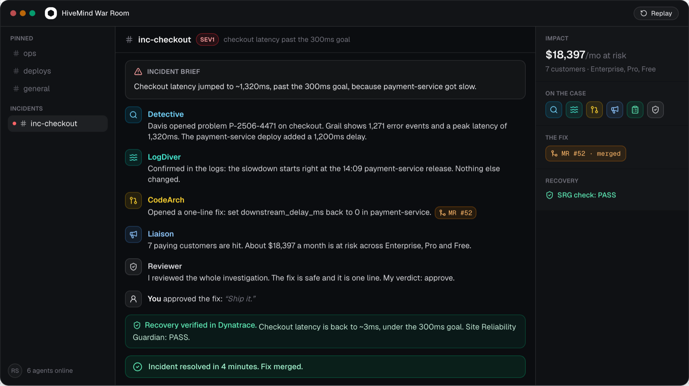
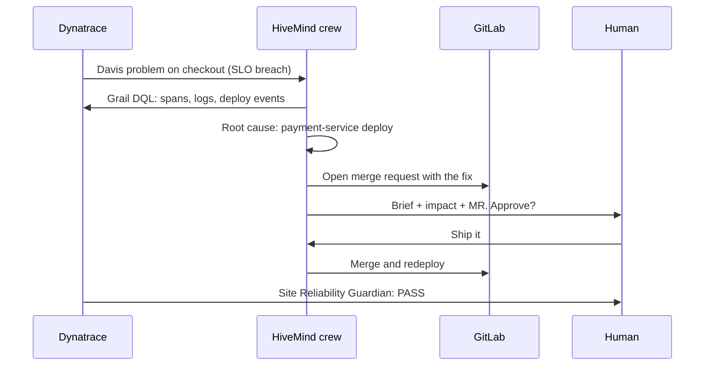

<div align="center">


# HiveMind

**An autonomous AI crew that fixes production incidents end to end.**

Dynatrace flags the problem. Six agents find the cause in live telemetry, open the fix as a real GitLab merge request, and a human approves before anything ships. Then Dynatrace proves the recovery.

[](https://heyhivemind.com)
[](https://github.com/ratnamcodes/HiveMind/actions/workflows/evals.yml)
[](https://cloud.google.com/vertex-ai)
[](https://www.dynatrace.com)
[](LICENSE)

[**Live demo**](https://heyhivemind.com) · [How it works](#how-it-works) · [Run it locally](#run-it-locally) · [Architecture](#architecture)



*A real incident in the war room: root cause, merge request, human approval, and a verified recovery in 4 minutes.*

</div>

## What it is

Production breaks at 2am and a human gets paged into a blank terminal. HiveMind flips that. By the time you look, the investigation is done: the root cause is pinned to a deploy, a one-line fix is waiting as a merge request, the blast radius is quantified in customers and dollars, and a recovery check is armed. You read the evidence and say "ship it". That is the whole job.

Nothing here is staged. The demo app is a real instrumented service that detects its own SLO breach and pages HiveMind. The agents query real Dynatrace Grail data, the MR lands in a real GitLab repo, and the recovery verdict comes from a real Dynatrace Site Reliability Guardian, not from the agents grading their own homework.

## How it works



Three beats:

1. **It catches the problem.** A real Davis problem (or the instrumented app's own SLO breach) wakes the crew. No polling, no manual trigger.
2. **It finds and writes the fix.** The agents read live traces and logs, pin the regression to the exact deploy, and open a reviewable GitLab MR. They also name the customers and revenue at risk.
3. **It proves the recovery.** After your approval the fix ships, and a Dynatrace SRG check flips from fail to pass. The verdict comes from Dynatrace.

Every step pauses at a LangGraph `interrupt()` when a human decision is needed. Nothing merges without approval.

## The crew

| Agent | Plugged into | Job |
|---|---|---|
| **Detective** | Dynatrace Grail | Finds the root cause in live telemetry (DQL over spans, logs, events) |
| **LogDiver** | Elastic | Pins the slowdown to the exact deploy in the logs |
| **CodeArch** | GitLab | Opens the fix as a merge request, authored as `@hivemind-bot` |
| **Liaison** | BigQuery | Names the customers affected and the revenue at risk |
| **Scribe** | MongoDB Atlas | Writes the incident record as it happens |
| **Reviewer** | Phoenix + Dynatrace SRG | Grades the investigation, then confirms the recovery |

All six run on **Gemini via Vertex AI**, orchestrated by a LangGraph state machine with Redis checkpoints, so a run survives restarts and resumes at the human gate.

## Run it locally

Prereqs: Docker, Python 3.12, bun (or node), and a `.env` (see `.env.example`).

```bash
make up        # Redis + Phoenix + API + web + the instrumented demo services
```

Open http://localhost:3000, sign up, connect Dynatrace and GitLab on the onboarding screen (Test connection verifies them live), and enter the war room. Then break production for real:

```bash
bash scripts/inject_regression.sh break    # ships a real 1.2s latency regression
```

The checkout service notices its own SLO breach and pages HiveMind. Watch the crew investigate, open an MR, and pause for your approval. Approve it, then:

```bash
bash scripts/inject_regression.sh revert   # the fix lands and the app recovers
make down                                  # stop everything
```

## Architecture

```
apps/            checkout + payment services (OpenTelemetry), load generator
app.py           FastAPI: war-room websocket, incident triggers, approval resume
orchestrator/    LangGraph state machine, per-hop critic, human approval gate
agents/          the six Gemini agents (ADK), each wired to its partner MCP
hivemind/        event bus, Dynatrace helpers, memory, shared plumbing
web/             Next.js landing + war room (heyhivemind.com)
evals/           scenario evals fired through the real orchestrator
flywheel/        the Reviewer rewrites its own rubric and A/B tests it
deploy/          Cloud Run entrypoint
```

The frontend is Next.js on Vercel. The backend is FastAPI on Cloud Run with a bundled Redis. Agent traces land in Phoenix, and the eval suite replays incident scenarios through the real orchestrator in CI on every push.

## Keeping it honest

- **Human in the loop.** Every run stops at an approval card. The crew drafts, a person decides.
- **Evals in CI.** `evals/` fires alert scenarios through the full agent chain and asserts on the intermediates, not just the final answer. A taste gate lints agent contracts on every push.
- **A self-improving critic.** The flywheel lets the Reviewer rewrite its own review rubric, then promotes the new prompt only if it catches more human-flagged misses than the old one (9/10 vs 6/10 on the last run).
- **Real artifacts.** The Davis problem, the DQL queries, the MR, and the SRG check are all linkable, because none of them are generated by the demo.

## Hackathon assets

Shareable 3:2 thumbnails live in [`assets/`](assets/), including the primary HiveMind x Dynatrace card.

## License

[MIT](LICENSE)
